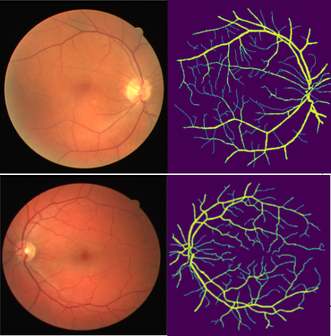

# Retinal_blood_vessel_Segmentation
https://www.kaggle.com/competitions/sai-vessel-segmentation/overview


## Dependencies
```shell
sudo apt-get update
sudo apt-get install ffmpeg libsm6 libxext6  -y
pip install imgaug
pip install -U scikit-learn scipy matplotlib
pip install pandas
```
## Codes:
### showimg.py
### train.py
* This code can be train on Google Colab
## Datasets: 
In order to prevent the database from being deleted, I first backed it up to my personal cloud space.
[Download Link](https://drive.google.com/drive/folders/1l_hZbxdLA_FtGKKI6yjV0fMYg1NkY-LX?usp=sharing)

