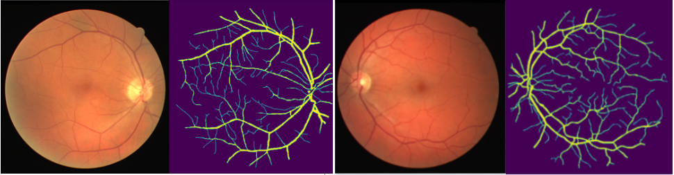

# Retinal_blood_vessel_Segmentation
https://www.kaggle.com/competitions/sai-vessel-segmentation/overview


## Dependencies
* tensorflow-21.02-tf1-py3:latest

```shell
sudo apt-get update
sudo apt-get install ffmpeg libsm6 libxext6  -y
pip install imgaug
pip install -U scikit-learn scipy matplotlib
pip install pandas
```
## Codes:
### showimg.py
```shell
python showimg.py
```
### train.ipynb
* This code can be trained on Google Colab.
* Augmentation lets the model more robust.
* With the early stop callback mechanism.
* validation training diagrams.


* My trained Weight: [Download link](https://drive.google.com/file/d/1WRKbSI7dXbbpayZgip-8egPuQKgEP0kh/view?usp=sharing)

### inference.ipynb
* This code directly uses Google Colab for inference images.
* Inference with different confidence thresholds:


## Competition Result:


## Datasets: 
In order to prevent the database from being deleted, I first backed it up to my personal cloud space.
[Download Link](https://drive.google.com/drive/folders/1l_hZbxdLA_FtGKKI6yjV0fMYg1NkY-LX?usp=sharing)

